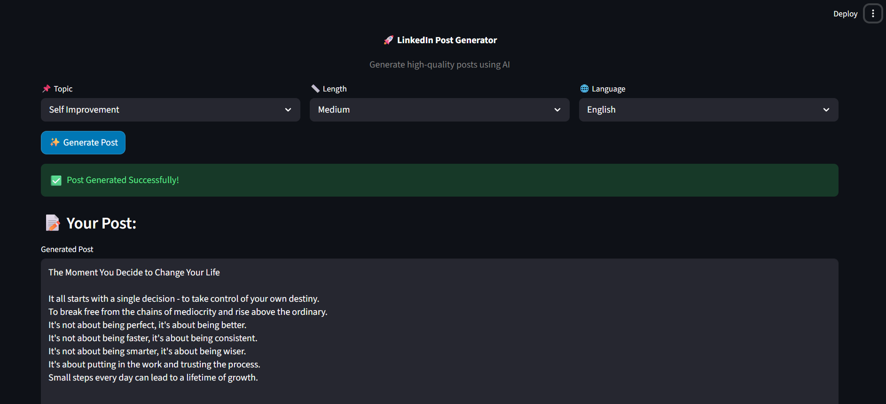

# GenAI LinkedIn Post Generator

This project is a simple AI-based tool that helps generate LinkedIn posts based on a user's previous writing style.

The idea is to take past posts, understand patterns like topic, language, and length, and then generate new posts that feel similar.

---

## How it works

**Step 1: Data Processing**

* Input: Past LinkedIn posts
* Extracts:

  * Topic (tags)
  * Language (English / Hinglish)
  * Length (Short / Medium / Long)

**Step 2: Post Generation**

* User selects topic, length, and language
* Relevant past posts are used as examples (few-shot prompting)
* A new post is generated using an LLM

---

## Features

* Generate LinkedIn posts based on topic
* Supports English and Hinglish
* Adjustable length (Short, Medium, Long)
* Uses past posts to match writing style

---

## Tech Stack

* Python
* Streamlit
* LangChain
* Groq API

---

## Setup

1. Clone the repository

```bash
git clone https://github.com/your-username/Genai-linkedin-post-generator.git
cd Genai-linkedin-post-generator
```

2. Install dependencies

```bash
pip install -r requirements.txt
```

3. Add your API key

Create a `.env` file:

```env
GROQ_API_KEY=your_api_key_here
```

4. Run the app

```bash
streamlit run main.py
```

---

## Project Screenshot



---

## Notes

* Make sure `.env` is not pushed to GitHub
* Regenerate your API key if it was exposed earlier

---

## Future Improvements

* Add hashtag generation
* Add engagement prediction
* Improve UI

---

This project was built to practice GenAI concepts like prompt engineering and few-shot learning.
